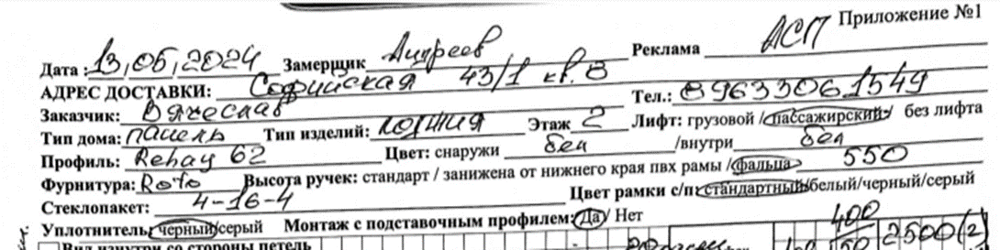
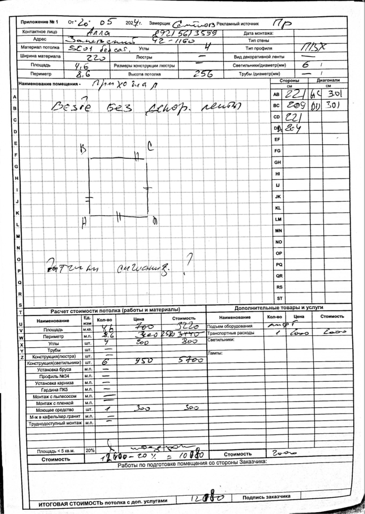

**Лист замера** -- официальный документ, который является:

-  **Приложением №1 к договору**,

-  **техническим заданием в производство**,

-  **основой для монтажных работ**.

**Ошибка на этом этапе -- критична и влечёт за собой:**

-  переделку изделий,

-  затраты на выезд и доставку,

-  срыв сроков,

-  недовольство клиента,

-  рекламации и потери.

---

## ✅ **1 ЭТАП. МЕНЕДЖЕР ОТДЕЛА ПРОДАЖ -- ПРИЁМКА ЛИСТА ЗАМЕРА**

### 🔍 Проверяем ШАПКУ листа:

{width=1090px height=273px}

| Поле                   | Что проверяем                                       |
|------------------------|-----------------------------------------------------|
| **Дата замера**        | Последняя, актуальная (если было несколько замеров) |
| **Замерщик**           | Указано ФИО замерщика (материально ответственен)    |
| **Рекламный источник** | Заполнен (для аналитики)                            |
| **Адрес доставки**     | Совпадает с договором                               |
| **Заказчик**           | Совпадает с договором                               |
| **Телефон**            | Совпадает с договором                               |
| **Тип дома**           | Указан (панельный, кирпичный и т.д.)                |
| **Тип изделия**        | Указан (окно, балкон, лоджия и т.п.)                |
| **Этаж, лифт**         | Заполнены                                           |

### ⚙️ Проверяем ТЕХНИЧЕСКУЮ ЧАСТЬ:

-  Профиль

-  Цвет профиля

-  Фурнитура

-  Стеклопакет (тип, камерность)

-  Высота ручки

-  Цвет дистанционной рамки

-  Цвет уплотнителя

### 📎 Документы, прилагаемые к листу:

-  Чертежи

-  Эскизы

-  Фото при необходимости

### ✅ После проверки:

-  Ставим подпись и дату на листе

-  Фиксируем приёмку в CRM

-  Передаём лист на следующий этап

   Лист замера по потолкам должен выглядеть следующим образом:

   {width=1090px height=1533px}

---

## 🧩 **2 ЭТАП. МЕНЕДЖЕР ПО ТЕХНИЧЕСКОЙ ПРОВЕРКЕ ДОГОВОРОВ (ОТДЕЛ МОНТАЖА)**

### Задачи:

-  Проверка соответствия замерного листа договору:

   -  Метраж

   -  Количество изделий

   -  Комплектация

-  Выявление противоречий (например, в договоре одно изделие, а в замере два)

-  Проверка корректности конфигураций:

   -  Открывания

   -  Проветривания

   -  Способ крепления

**Если есть ошибки:**

-  Возврат менеджеру по продажам/замерщику

-  Устранение расхождений до передачи дальше

---

## 🧾 **3 ЭТАП (временно, до внедрения новых программ):**

### 👉 **Передать договор в бухгалтерию для внесения в 1С и КБ**

-  Скан или оригинал договора и листа замера передаётся в бухгалтерию

-  Бухгалтер вносит данные в учётные системы:

   -  1С (для складского и производственного учёта)

   -  КБ (кредитование, предоплата, аналитика)

---

## 📐 **4 ЭТАП. МЕНЕДЖЕР ПО ПОСТРОЕНИЮ ЧЕРТЕЖЕЙ**

### Задачи:

-  На основании замерного листа создаёт рабочие чертежи изделий

-  Использует специализированное ПО (например, Proplex, WinCalc и др.)

-  Чертеж должен соответствовать:

   -  Замеру

   -  Договору

   -  ТЗ от отдела продаж

### Результат:

-  Готовые чертежи направляются в производство

-  Сохраняются в карточке клиента / общей папке

---

## 🔧 **5 ЭТАП. МЕНЕДЖЕР ОТДЕЛА МОНТАЖА 1**

### Задачи:

-  Формирование монтажного ТЗ:

   -  Что везти, куда, в каком составе

   -  Особенности подъезда, этаж, наличие лифта

-  Формирование бригады и графика работ

-  Визуальная проверка чертежей

-  Назначение ответственного монтажника

---

## 🛠️ **6 ЭТАП. МЕНЕДЖЕР ОТДЕЛА МОНТАЖА 2**

### Задачи:

-  Контроль логистики:

   -  Дата и время доставки изделий

   -  Наличие упаковки, доборов, фурнитуры

-  Связь с заказчиком:

   -  Подтверждение даты монтажа

-  Контроль исполнения монтажных работ:

   -  Фотофиксация

   -  Акт приёма-передачи

   -  Получение отзывов


## 📌 ИТОГОВАЯ ЦЕПОЧКА ОБРАБОТКИ ЗАМЕРНОГО ЛИСТА:


`1. Менеджер продаж (приёмка и проверка)`

```
                              `↓`
```

`2. Менеджер тех. проверки договоров (монтаж)`

```
                              `↓`
```

`3. Бухгалтерия (временно: ввод в 1С и КБ)`

```
                              `↓`
```

`4. Менеджер по построению чертежей (строит натяжные потолки)`

```
                              `↓`
```

`5. Менеджер по монтажу 1 (формирование ТЗ и накладных)`

```
                              `↓`
```

`6. Менеджер по монтажу 2 (логистика и контроль исполнения)`