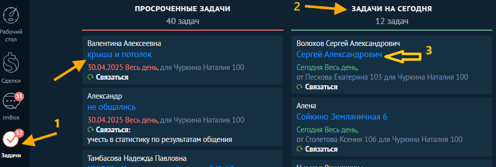
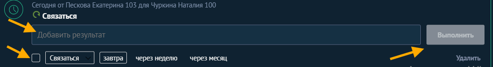

#### Просроченных задач в идеале не должно быть, а если они и есть - это пара задач, которые можно закрыть до конца дня. Просроченные задачи не должны тянуться за вами

## 🔹 ШАГ 1. Переход в раздел задач

1. Заходим в раздел **«Задачи»** (см. скриншот 1).

2. Выбираем задачу на **сегодняшнюю дату** (см. скриншот 2).

3. **Проваливаемся** в задачу (нажимаем на неё, см. скриншот 3).

{width=971px height=327px}

📌 *Скриншот 1: Вход в задачи*

📌 *Скриншот 2: Задачи на сегодня*

📌 *Скриншот 3: Открытие нужной задачи*

---

## 🔹 ШАГ 2. Работа с задачей и постановка новой

1. Внутри сделки, на которую поставлена задача **созваниваемся с клиентом**.

2. Если, например, договорились созвониться завтра, **добавляем результат** текущей задачи (комментарий, из которого понятно что происходило/запись звонка).

3. Ставим **галочку «Поставить следующую»**.

4. Выбираем **дату, время** и **тип действия** (звонок, встреча и пр.).

5. Нажимаем **«Выполнить»**.

{width=1045px height=143px}

📌 *Скриншот 4: Работа внутри задачи*

📌 *Скриншот 5: Установка следующей задачи*

---

## 🔹 ШАГ 3. Проверка постановки новой задачи

После выполнения:

-  Сегодняшняя задача **отмечена как выполненная**.

-  **Новая задача** успешно поставлена на завтра.

{width=827px height=521px}

📌 *Скриншот 6: Готовая последовательность задач*

---

## ❗ ВАЖНО:

### Все действия должны быть подтверждены:

| Действие              | Что фиксируется                                                                |
|-----------------------|--------------------------------------------------------------------------------|
| 📞 Звонок             | Запись разговора + краткий комментарий                                         |
| ✉ Письмо              | Почта клиента в карточке, письмо отразится автоматически                       |
| 📲 Общение вне AmoCRM | Обязательно **написать вручную** комментарий с суть общения и договорённостями |

---

## 🗓 Логика постановки задач по этапам

---

### Этап «Думает»:

1. Завтра – звонок.

2. Не ответил --> завтра + WhatsApp.

3. Не ответил --> звоним через 1 день

4. Не ответил --> через 3 дня.

5. Не ответил --> через 2 недели + WhatsApp.

6. Не ответил --> через 2 недели.

7. Не ответил -->  через месяц.

🔚 Затем: Переводим сделку в **«Закрыто и не реализовано»** с причиной: «Не выходит на связь».

---

### Этап «Думает после замера»:

1. Завтра – звонок.

2. Не ответил --> завтра + WhatsApp.

3. Не ответил --> через 1 день.

4. Не ответил --> через 3 дня.

5. Не ответил --> через неделю + WhatsApp.

6. Не ответил --> через 2 недели.

7. Не ответил --> через месяца + WhatsApp.

🔚 Затем: Переводим сделку в **«Закрыто и не реализовано»** с причиной: «Не выходит на связь».

---

## 💬 Напоминание:

**Каждый клиент**, обратившийся в компанию, **обязан получить презентацию** компании по **WhatsApp или электронной почте**!

Пример первичного сообщения:

**Здравствуйте, \[ИМЯ\]! 😊**\
Мы -- **команда Нью Лайф**: специалисты по натяжным потолкам и остеклению 💪

💥 *Скидки и акции* на натяжные потолки -- не упустите шанс!\
🌐 [www.nwlife.ru](http://www.nwlife.ru)

📍 Работаем с 2007 года -- 17 лет опыта и довольных клиентов!\
⭐ *Рейтинг 4,9* на Яндекс: [Посмотреть отзывы](https://yandex.ru/profile/1274531058)\
🔧 *Гарантия 10 лет* на все потолки\
📏 Бесплатный замер -- звоните: +7 (812) 646-80-89

С нами -- без переплат, без сюрпризов, только профессиональный результат 🏆\
Пишите нам в ответ на это сообщение, будем рады ответить на Ваши вопросы!