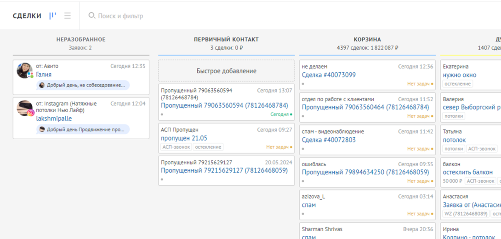
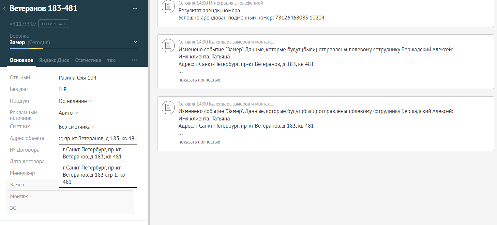

**1\. Источники сообщений**

Сообщения от клиентов могут поступать:

-  Из мессенджеров и соцсетей

-  С сайта (заявки на замер, расчёт и т. д.)

При поступлении запроса в **AmoCRM** создаётся сделка на этапе **«Неразобранное»**. Сообщение можно увидеть в этой сделке или в **ImBox**.

Не забываем о том, что при любом целевом обращении нужно толкать клиента на следующий этап ЗАМЕР -> ЗАКЛЮЧЕНИЕ и т.д. используя предоставленные инструменты

{width=1090px height=522px}

*(Cкрин 1: Пример сделки в «Неразобранном»)*

---

**2\. Время ответа**

-  **10 минут** – максимальное время ответа на сообщение.

---

**3\. Действия в зависимости от типа запроса**

#### **3\.1. Вопрос не по продукту компании**

-  Переместите сделку на этап **«Корзина»**.

-  Задачу **не ставим**, с клиентом не работаем.

---

#### **3\.2. Вопрос по продукту, клиент готов на замер**

1. Уточните данные для замера и карточки клиента:

   -  Дата и время замера

   -  Адрес

   -  Контактное лицо

   -  Объём работ

   -  Источник информации о компании

2. Заполните **карточку клиента**.

3. Создайте сделку.

4. Переведите этап на **«Замер»**.

5. Заполните **форму заявки на замер** в графике замеров.

   {width=1524px height=693px}

*(Cкрин 2: Пример заполненной карточки клиента на этапе «Замер»)*

---

#### **3\.3. Вопрос по продукту, клиент не готов на замер**

1. Уточните данные для карточки клиента и предварительного расчёта:

   -  Имя клиента

   -  Интересующий продукт

   -  Источник информации о компании

   -  Дату следующего контакта

   -  Причину отказа от замера

2. Заполните **карточку клиента**.

3. Создайте сделку.

4. Переведите этап на **«Думает»**.

5. Добавьте **примечание** с кратким описанием разговора (оно должно быть понятно без прослушивания).

6. Создайте **задачу** на следующий контакт.

*(Место для скрина 4: Пример этапа «Думает» и задачи)*

---

**4\. Заявки с сайта**

-  Приходят на **электронную почту**.

-  Время обработки (звонка клиенту) – **10 минут**.

-  Алгоритм работы **такой же**, как и с сообщениями из мессенджеров.

*(Место для скрина 5: Пример заявки с сайта в почте)*