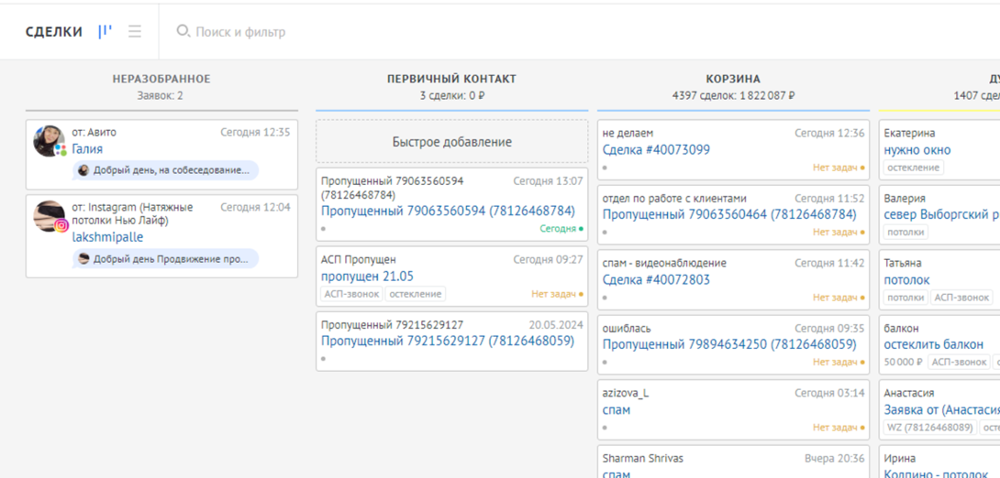

### 🔹 Этап: **Первичный контакт с клиентом**

При первом обращении клиента в мессенджерах, соцсетях или через сайт менеджер обязан:

#### ⏱ В течение 10 минут:

-  Открыть сделку в AmoCRM (находится в этапе “Неразобранное” или в InBox).

-  {width=1090px height=522px}

-  Ответить клиенту в том же канале, где он написал, или позвонить, если это заявка с сайта. Нужно обращать внимание, как хочет связаться клиент, на сайте есть кнопка «напишите мне через вацап», и в письме приходит соответствующая пометка

#### ✅ Задачи первичного контакта:

-  Установить контакт с клиентом (приветствие, представиться).

-  Выяснить цель обращения.

-  Определить, целевой ли клиент.

-  Собрать минимально необходимую информацию.

---

### 📝 **5 обязательных вопросов при первом общении:**

1. **Как вас зовут?**

2. **Что именно вас интересует?** (какой продукт, объект, пожелания)

3. **Уточните, пожалуйста, адрес (или город)?**

4. **Когда было бы удобно принять замерщика (если готовы)?**

5. **Откуда вы узнали о нашей компании?**

---

Дополнительно, если клиент **не готов к замеру**, уточняется причина отказа и планируется следующий контакт. После сбора всей информации:

-  Заполняется карточка клиента.

-  Создаётся сделка с нужным этапом: “Замер”, “Думает” или “Корзина”.

-  Добавляется примечание -- краткое описание о чем общались с клиентом

-  Ставится задача для следующего действия (связаться через 1-2 дня, сделать контакт, переставить задачу на следующий период) 

Если вопрос **не касается продукта** компании, его необходимо переместить на этап «**Корзина**» - задача в этом случае не ставится, с данной сделкой **работать мы не будем**

