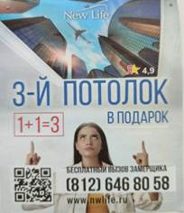
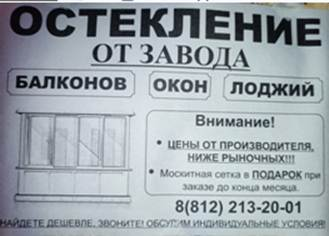

При обращении клиента важно корректно указывать рекламный источник, т.к. от этого зависит аналитика эффективности рекламных кампаний, верное распределение бюджета и целесообразность расходов, заложенных на каждый из рекламных каналов.

#### Необходимо всегда уточнять рекламный источник, кроме очевидных - таких как «Лиды АСП», «Авито», «ДМП», заказы от прорабов и выставочных залов.

Основные рекламные источники:



---

*  

   Рекламный источник

*  

   Направление

*  

   Способы получения рекламной продукции или ознакомления с ней

---

*  

   Домовой

*  

   Потолки

   Окна

*  

    Флаер выдаётся покупателям в магазинах сети на кассе при выдаче чека.

    

   Флаер с июня 2024г:

   

   Флаер до июня 2024г:

   

---

*  

   Петрович

*  

   Потолки

   Окна

*  

   Флаер прикрепляется к накладной покупателя в магазинах сети при доставке на адрес.

    

   Флаер с июня 2024г:

    

   

    

   

    

   Флаер до июня 2024г:

   

    

    

---

*  

   Лиды АСП

*  

   Окна

*  

   Расклейка объявлений на информационных досках жилых домов:

   

---

*  

   Интернет

*  

   Потолки

   Окна

*  

   Сайты в поисковой выдаче:

   <https://nwlife.ru/>

   <https://balkonvspb.ru/>

---

*  

   ДМП

*  

   Потолки

   Окна

*  

   Колл-центр обзванивает клиентов, оформивших заявки или совершивших звонки конкурентам, если клиент готов получить от нас предложение, то колл-центр передает нам информацию.

---

*  

   Авито / Авито-бот

*  

   Потолки

   Окна

*  

   Продвигается от 2х объявлений единовременно.

   <https://clck.ru/3BNmLj>

   Если контакт передал чат-бот, то менеджер указывает рекламный источник «Авито-бот».

---

*  

   2ГИС

*  

   Потолки

   Окна

*  

   Продвижение на гео-сервисах.

   <https://go.2gis.com/1qqjxy>

   <https://yandex.ru/maps/-/CDvfMW1G>

   <https://yandex.ru/maps/-/CDvfMDL5>

---

*  

   Яндекс Карты

---

*  

   ПК (постоянный клиент)

*  

   Потолки

   Окна

*  

   Фиксация ПК возможна при подтверждении в КБ. Либо на объекте клиент предъявляет дисконтную карту, договор или промопродукцию в виде папки, ручки, кружки, что подтверждает наш контакт с клиентом.

---

*  

   Знакомые

*  

   Потолки

   Окна

*  

   Рекомендации знакомых, соседей и тд

---

*  

   Прорабы/дизайнеры

*  

   Потолки

   Окна

*  

    Рекомендации прорабов, дизайнеров

---

*  

   Выставочные залы

*  

   Потолки

   Окна

*  

   Есть договоренности с выставочными залами. Они предоставляют нам клиентов, мы им - премиальные отчисления.

   Список ВЗ, которые могут встретиться:

   -  ВЗ Колпино

   -  ВЗ Уточкина

   -  ВЗ Двери на дом

   -  ВЗ Народный

   -  ВЗ ЦСД Пушкин

   -  ВЗ Уютный дом

   -  ВЗ Двери на Хазова

---

*  

   Сотрудник

*  

   Потолки

   Окна

*  

   Сотрудник, работающий в настоящее время, либо бывший сотрудник.

---

*  

   Соц.сети

*  

   Потолки

   Окна

*  

   Вконтакте - <https://vk.com/nwliferu>

   Одноклассники - <https://ok.ru/group/59615712182499>

   Телеграм - <https://t.me/newlifepotolki>

   Инстаграм - <https://www.instagram.com/new_life_potolki>

---

*  

   Рекламные источники, которые на данный момент не активны:

---

*  

   Аутсейл

*  

   Потолки

   Окна

*  

   Колл-центр в феврале 2025г. обзванивал клиентов, заказавших у нас в 2023-24 гг остекление, но у которых в этот период не было создано сделок по натяжным потолкам, с вопросом – есть ли потребность в натяжных потолках или остеклении.

---

*  

   Максидом

*  

   Окна

*  

    Флаер приезжал на адрес вместе с доставкой товара из магазина сети.

   

---

*  

   Лендинг

*  

   Потолки

*  

   <https://newlifepotolok.ru/> - одностраничный сайт (лендинг) продвигался отдельно от многостраничного в поисковой выдаче Яндекса.

---

*  

   Чек.книжки

*  

   Потолки

   Окна

*  

   Среди новоселов строительной компании "Лидер Групп" в 2023 распространялись чековые книжки новоселов, представляющие собой каталог скидочных купонов на различные товары/услуги для дома.

   -  ЖК «Колумб» б-р Головина 3 к1

   -  ЖК «Магеллан» Вадима Шефнера 4 (2522 квартиры)

   -  ЖК «Аэросити 2» Шушары, Старорусский пр. 9

   

    

    

   

    

   

---

*  

   Строитель

*  

   Потолки

   Окна

*  

   Флаер выдавался покупателям в магазинах сети при выдаче чека до сентября 2023г.



 

#### ⚠️ Рекламный источник в АМО «Уточнить на замере» следует выбирать только в тех случаях, когда клиент записывается на замер, при этом менеджером уже были предприняты попытки выяснить информацию, но ситуация по-настоящему неопределенная (например, клиент говорит, что нашел листовку в почтовом ящике и тп). После замера нужно обязательно внести в АМО рекламный источник, который уточнил замерщик.

| № тел.    | Сеть                   |
|-----------|------------------------|
| 646-80-58 | "Домовой"              |
| 6666-090  | "Петрович"             |
| 646-80-76 | "Максидом"             |
| 646-80-79 | "Строитель", VK, Авито |

Каждому из рекламных источников присвоен уникальный телефонный номер (т.е. на флаерах, предназначенных для разных торговых сетей указаны разные номера), при звонке по которому клиент попадает в amo. Пока менеджер не взял трубку, отображается тот номер телефона, который клиент набирал. Отображение данной информации не отменяет вопроса, откуда клиент узнал о нас.

Существует несколько распространенных ситуаций, при которых указание рекламного источника может вызвать затруднения:

| Ситуация                                                                                                                                                                                                         | Решение                                                                                                                                                                                           |
|------------------------------------------------------------------------------------------------------------------------------------------------------------------------------------------------------------------|---------------------------------------------------------------------------------------------------------------------------------------------------------------------------------------------------|
| Клиент (прораб/дизайнер) готов стать нашим партнером, но это его первый заказ                                                                                                                                    | Указать рекламный источник, по которому клиент вышел на нас и «/прораб». Например «Авито/прораб». И только начиная со второго договора указывается рекламный источник "прораб", "дизайнер" и т.д. |
| Клиент говорит, что уже заказывал у нас и обращается по номеру телефона из листовки магазина или по АСП                                                                                                          | Указать рекламный источник, соответствующий рекламной листовке, т.к. триггером для обращения стала именно листовка/объявление.                                                                    |
| Клиент говорит, что нашел листовку в почтовом ящике                                                                                                                                                              | Менеджеру не настаивать, что это маловероятный вариант, а замерщику обязательно приколоть листовку к договору.                                                                                    |
| Клиент оставил заявку на сайте, написал в мессенджер или на эл.почту                                                                                                                                             | Уточнить рекламный источник, т.к. клиент мог начать изучать сайт вследствие получения флаера.                                                                                                     |
| Был замерен объект с поэтапным оформлением договоров. Например, были замерены потолки и балконный блок - договор на потолки был оформлен сразу, а договор на балконный блок заключили дистанционно спустя время. | Рекламный источник на всех замерных листах указать один - тот, откуда пришел к нам клиент.                                                                                                        |
| Клиент обратился в один день с разных рекламных источников, предполагая, что обращается в разные компании                                                                                                        | Фиксируется только тот рекламный источник, с которого мы получили целевое действие – замер/договор. Если целевого действия не было, то фиксируем в amo все рекламные источники в примечании       |
| Клиент не знает, не помнит рекламный источник                                                                                                                                                                    | Указать рекламный источник «Другое» и написать в примечании, что клиент не помнит/не знает источник                                                                                               |

Категорически запрещается указывать рекламный источник, не соответствующий действительности!